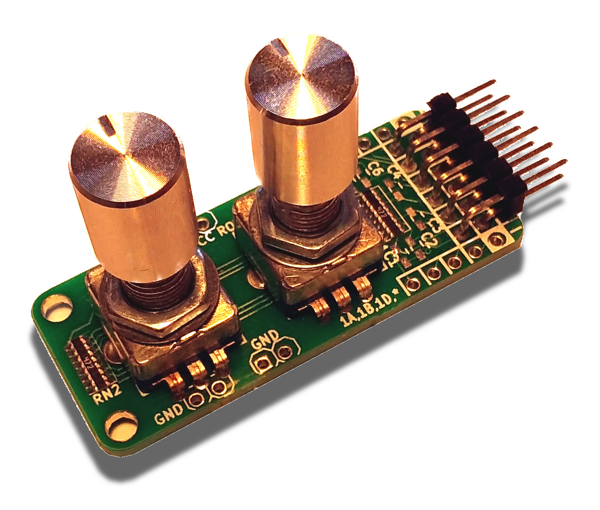

# StickIt! SmallButtons Module Repository

## Description

The StickIt! Rotary Encoder Module puts two rotary encoders onto a small
board that is usable on a breadboard or through a PMOD connector.

* License: [CC BY 4.0](http://creativecommons.org/licenses/by/4.0/legalcode)
* Documentation: [https://xesscorp.github.io/StickIt-RotaryEncoder](https://xesscorp.github.io/StickIt-RotaryEncoder)

## Features

* It has two independent, rotary encoder withs integrated ON/OFF pushbuttons.
* Each encoder has 12 detents.
* Insertable into a solderless breadboard.
* Also usable through its PMOD interface.
* Small: 0.8" &times; 1.95".
* Compatible with the [StickIt! Motherboard](http://www.xess.com/shop/product/stickit-mb-4_0/).
* Completely open source.
* Some people think it smells very nice.

[ StickIt-Rotary Encoder Schematic ](https://xesscorp.github.io/StickIt-RotaryEncoder/misc/schematic.pdf)

